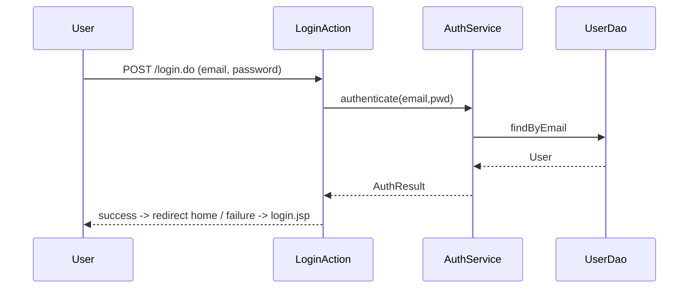
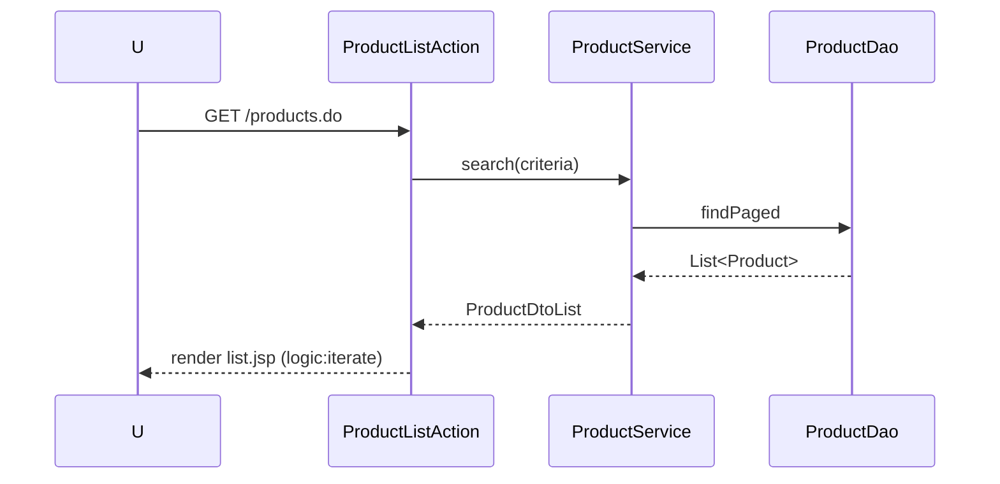
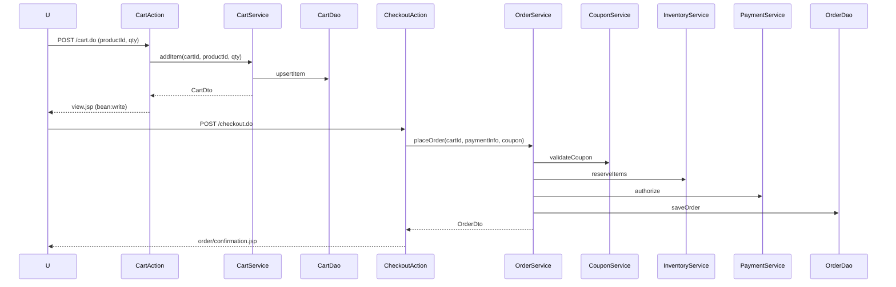
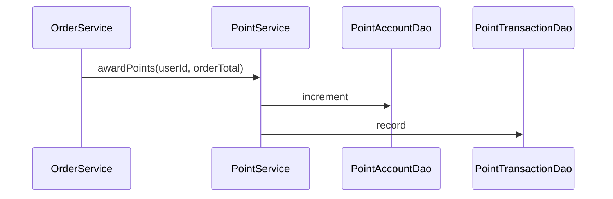

# Monolithic Struts 詳細設計書（Java 1.5 / JSP / Struts 1.2.9）

<!-- markdownlint-disable MD013 -->

## 1. 概要

- スキーショップECを**モノリシック**に実装（マイクロサービス群を単一 WAR に統合）。
- 技術制約: **Java 1.5**, **JSP**, **Struts 1.2.9**, Strutsタグライブラリ（`html`, `bean`, `logic`, `tiles`）。
- 設計方針: **レイヤードアーキテクチャ** + **オーソドックスなGoF/EEパターン**
  - Front Controller（Struts ActionServlet）
  - Command（Action）、ActionForm
  - MVC（JSP=View, Action=Controller, Service/Domain=Model）
  - Service Facade / Business Delegate / Service Locator
  - DAO + DTO/ValueObject
  - Template Method（DAO共通化）
  - Intercepting Filter / RequestProcessor（認証・権限チェック）
  - Singleton（サービスロケータ、ファクトリ）

## 2. 要件・制約

- **言語仕様**: Java 1.5（ジェネリクスは任意、注釈無し、ラムダ不可、Stream不可）
- **UI**: JSP + Strutsタグ (`<html:form>`, `<html:text>`, `<bean:write>`, `<logic:iterate>`)
- **Controller**: Struts 1.2.9（XML設定ベース）
- **DI**: 手動（ServiceLocator / Factory）
- **永続化**: JDBC + DAO（Commons DBCP, Commons DbUtils 可）
- **View合成**: Tiles 1.x（任意） or JSP include
- **ビルド**: Maven 2 もしくは Ant（推奨: Maven 2, maven-compiler-plugin 1.5）
- **アプリサーバ**: Tomcat 6.x / Java 5 対応コンテナ
- **ログ**: log4j 1.2
- **テスト**: JUnit 4.12（Java5対応）または JUnit 3.8 + StrutsTestCase
- **メール送信**: JavaMail 1.4.x（SMTP）

## 3. 技術スタック

| 区分 | 技術 | バージョン | 用途 |
| ---- | ---- | ---------- | ---- |
| 言語 | Java | 1.5 | アプリ実装 |
| Web FW | Struts | 1.2.9 | MVC, Front Controller |
| View | JSP | 2.0 | テンプレート |
| Taglib | struts-html/bean/logic/tiles | 1.2.x | ビュー操作 |
| JDBC | commons-dbcp | 1.2.x | コネクションプール |
| JDBC補助 | commons-dbutils | 1.1 | クエリ補助（任意） |
| ログ | log4j | 1.2.17 | ロギング |
| メール | JavaMail | 1.4.7 | 通知メール |
| テスト | JUnit | 3.8/4.x | 単体テスト |
| ビルド | Maven | 2.2.x | 依存管理 |

## 4. レイヤードアーキテクチャ

```text
Presentation (JSP/Tiles + Struts Taglib)
   ↑ Action (Controller) - org.apache.struts.action.Action
   ↑ Form (ActionForm) - 入力検証 (Commons Validator)
   ↑ Service Facade / Business Delegate
   ↑ Domain/DTO (POJO, JavaBean)
   ↑ DAO (JDBC) + Template Method
   ↑ Infrastructure (DBCP, Transaction管理, ServiceLocator)
```

### デザインパターン適用

- **Front Controller**: `ActionServlet` + `RequestProcessor`
- **Command**: `Action` クラス単位で処理
- **Service Facade**: `*Service` はユースケース単位のAPIを提供
- **Facade**: `OrderFacade` で注文処理など複合ユースケースを集約
- **Business Delegate**: Action → Serviceを仲介（結合度低減）
- **DAO**: DBアクセスをカプセル化、SQL管理
- **DTO/VO**: JSPへ渡す表示データオブジェクト
- **Template Method**: `AbstractDao` に共通処理（接続/例外/close）
- **Intercepting Filter**: 認証・権限チェック（`AuthRequestProcessor`）

## 5. モジュール構成（マイクロサービス統合）

| 元サービス | モノリス内モジュール/パッケージ例 |
| ------------ | ------------------------------- |
| frontend-service | `com.skishop.web` (Actions/JSP), `com.skishop.service.catalog` |
| authentication-service | `com.skishop.service.auth`, `com.skishop.domain.user` |
| coupon-service | `com.skishop.service.coupon` |
| inventory-management-service | `com.skishop.service.inventory` |
| payment-cart-service | `com.skishop.service.cart`, `com.skishop.service.payment` |
| point-service | `com.skishop.service.point` |
| sales-management-service | `com.skishop.service.order` |
| user-management-service | `com.skishop.service.user` |

### パッケージ例

```text
com.skishop.common
  ├─ util
  ├─ dao (AbstractDao, DaoException)
  ├─ service (ServiceLocator)
  ├─ validation
com.skishop.domain
  ├─ user (User, Role, UserSession)
  ├─ product (Product, Category, Price, Inventory)
  ├─ coupon (Coupon, Campaign)
  ├─ cart (Cart, CartItem)
  ├─ order (Order, OrderItem, Shipment, Return)
  ├─ point (PointAccount, PointTransaction)
  ├─ address (Address)
com.skishop.dto
  ├─ user (UserDto, LoginResultDto)
  ├─ product (ProductDto, CategoryDto)
  ├─ cart (CartDto, CartItemDto)
  ├─ order (OrderDto, OrderItemDto)
  ├─ coupon (CouponDto)
  ├─ point (PointBalanceDto)
com.skishop.service
  ├─ auth (AuthService)
  ├─ user (UserService)
  ├─ catalog (ProductService, CategoryService)
  ├─ inventory (InventoryService)
  ├─ coupon (CouponService)
  ├─ cart (CartService)
  ├─ payment (PaymentService)
  ├─ order (OrderService)
  ├─ point (PointService)
  ├─ shipping (ShippingService)
  ├─ tax (TaxService)
  ├─ mail (MailService)
com.skishop.dao
  ├─ user (UserDao, RoleDao, UserSessionDao)
  ├─ product (ProductDao, CategoryDao, PriceDao, InventoryDao)
  ├─ coupon (CouponDao, CampaignDao)
  ├─ cart (CartDao, CartItemDao)
  ├─ order (OrderDao, OrderItemDao, ShipmentDao, ReturnDao)
  ├─ point (PointAccountDao, PointTransactionDao)
com.skishop.web
  ├─ action (HomeAction, LoginAction, ProductListAction, ProductDetailAction, CartAction, CheckoutAction, CouponApplyAction, OrderHistoryAction, PointBalanceAction)
  ├─ form (LoginForm, ProductSearchForm, AddCartForm, CheckoutForm, CouponForm)
  ├─ filter / processor (AuthRequestProcessor)
  ├─ tiles (layouts)
```

## 6. Struts設定

### web.xml（抜粋）

```xml
<web-app>
  <display-name>SkiShop Monolith</display-name>

  <filter>
    <filter-name>CharacterEncodingFilter</filter-name>
    <filter-class>org.apache.catalina.filters.SetCharacterEncodingFilter</filter-class>
    <init-param>
      <param-name>encoding</param-name><param-value>UTF-8</param-value>
    </init-param>
  </filter>
  <filter-mapping>
    <filter-name>CharacterEncodingFilter</filter-name>
    <url-pattern>/*</url-pattern>
  </filter-mapping>

  <servlet>
    <servlet-name>action</servlet-name>
    <servlet-class>org.apache.struts.action.ActionServlet</servlet-class>
    <init-param>
      <param-name>config</param-name><param-value>/WEB-INF/struts-config.xml</param-value>
      <param-name>debug</param-name><param-value>2</param-value>
      <param-name>detail</param-name><param-value>2</param-value>
    </init-param>
    <load-on-startup>2</load-on-startup>
  </servlet>

  <servlet-mapping>
    <servlet-name>action</servlet-name>
    <url-pattern>*.do</url-pattern>
  </servlet-mapping>

  <welcome-file-list>
    <welcome-file>index.jsp</welcome-file>
  </welcome-file-list>
</web-app>
```

### struts-config.xml（抜粋）

```xml
<struts-config>
  <form-beans>
    <form-bean name="loginForm" type="com.skishop.web.form.LoginForm"/>
    <form-bean name="productSearchForm" type="com.skishop.web.form.ProductSearchForm"/>
    <form-bean name="addCartForm" type="com.skishop.web.form.AddCartForm"/>
    <form-bean name="checkoutForm" type="com.skishop.web.form.CheckoutForm"/>
    <form-bean name="couponForm" type="com.skishop.web.form.CouponForm"/>
    <form-bean name="registerForm" type="com.skishop.web.form.RegisterForm"/>
    <form-bean name="passwordResetRequestForm" type="com.skishop.web.form.PasswordResetRequestForm"/>
    <form-bean name="passwordResetForm" type="com.skishop.web.form.PasswordResetForm"/>
    <form-bean name="addressForm" type="com.skishop.web.form.AddressForm"/>
    <form-bean name="adminProductForm" type="com.skishop.web.form.admin.AdminProductForm"/>
  </form-beans>

  <global-exceptions>
    <exception key="error.global" type="java.lang.Exception" path="/error.jsp"/>
  </global-exceptions>

  <global-forwards>
    <forward name="home" path="/home.do"/>
    <forward name="login" path="/login.do"/>
    <forward name="products" path="/products.do"/>
    <forward name="cart" path="/cart.do"/>
  </global-forwards>

  <controller processorClass="com.skishop.web.processor.AuthRequestProcessor"/>

  <action-mappings>
    <action path="/home" type="com.skishop.web.action.HomeAction" scope="request" validate="false" input="/WEB-INF/jsp/home.jsp"/>
    <action path="/login" type="com.skishop.web.action.LoginAction" name="loginForm" input="/WEB-INF/jsp/auth/login.jsp" scope="request" validate="true">
      <forward name="success" path="/home.do"/>
      <forward name="failure" path="/WEB-INF/jsp/auth/login.jsp"/>
    </action>
    <action path="/register" type="com.skishop.web.action.RegisterAction" name="registerForm" input="/WEB-INF/jsp/auth/register.jsp" scope="request" validate="true">
      <forward name="success" path="/login.do"/>
      <forward name="failure" path="/WEB-INF/jsp/auth/register.jsp"/>
    </action>
    <action path="/password/forgot" type="com.skishop.web.action.PasswordForgotAction" name="passwordResetRequestForm" input="/WEB-INF/jsp/auth/password/forgot.jsp" scope="request" validate="true"/>
    <action path="/password/reset" type="com.skishop.web.action.PasswordResetAction" name="passwordResetForm" input="/WEB-INF/jsp/auth/password/reset.jsp" scope="request" validate="true"/>
    <action path="/products" type="com.skishop.web.action.ProductListAction" name="productSearchForm" input="/WEB-INF/jsp/products/list.jsp" scope="request" validate="false"/>
    <action path="/product" type="com.skishop.web.action.ProductDetailAction" input="/WEB-INF/jsp/products/detail.jsp" scope="request" validate="false">
      <forward name="success" path="/WEB-INF/jsp/products/detail.jsp"/>
      <forward name="notfound" path="/WEB-INF/jsp/products/notfound.jsp"/>
    </action>
    <action path="/cart" type="com.skishop.web.action.CartAction" name="addCartForm" input="/WEB-INF/jsp/cart/view.jsp" scope="session" validate="true"/>
    <action path="/checkout" type="com.skishop.web.action.CheckoutAction" name="checkoutForm" input="/WEB-INF/jsp/cart/checkout.jsp" scope="request" validate="true"/>
    <action path="/coupon/apply" type="com.skishop.web.action.CouponApplyAction" name="couponForm" input="/WEB-INF/jsp/cart/view.jsp" scope="request" validate="true"/>
    <action path="/orders" type="com.skishop.web.action.OrderHistoryAction" scope="request" validate="false" input="/WEB-INF/jsp/orders/history.jsp"/>
    <action path="/orders/cancel" type="com.skishop.web.action.OrderCancelAction" scope="request" validate="true"/>
    <action path="/orders/return" type="com.skishop.web.action.OrderReturnAction" scope="request" validate="true"/>
    <action path="/points" type="com.skishop.web.action.PointBalanceAction" scope="request" validate="false" input="/WEB-INF/jsp/points/balance.jsp"/>
    <action path="/logout" type="com.skishop.web.action.LogoutAction" scope="request" validate="false"/>
    <action path="/addresses" type="com.skishop.web.action.AddressListAction" scope="request" validate="false" input="/WEB-INF/jsp/account/addresses.jsp"/>
    <action path="/addresses/save" type="com.skishop.web.action.AddressSaveAction" name="addressForm" input="/WEB-INF/jsp/account/address_edit.jsp" scope="request" validate="true"/>
    <!-- Admin -->
    <action path="/admin/products" type="com.skishop.web.action.admin.AdminProductListAction" scope="request" validate="false" input="/WEB-INF/jsp/admin/products/list.jsp"/>
    <action path="/admin/product/edit" type="com.skishop.web.action.admin.AdminProductEditAction" name="adminProductForm" input="/WEB-INF/jsp/admin/products/edit.jsp" scope="request" validate="true"/>
    <action path="/admin/orders" type="com.skishop.web.action.admin.AdminOrderListAction" scope="request" validate="false" input="/WEB-INF/jsp/admin/orders/list.jsp"/>
    <action path="/admin/order/update" type="com.skishop.web.action.admin.AdminOrderUpdateAction" scope="request" validate="true"/>
  </action-mappings>

  <message-resources parameter="messages"/>
</struts-config>
```

### Tiles（任意） tiles-defs.xml（抜粋）

```xml
<tiles-definitions>
  <definition name="baseLayout" path="/WEB-INF/jsp/layouts/base.jsp">
    <put name="title" value=""/>
    <put name="header" value="/WEB-INF/jsp/common/header.jsp"/>
    <put name="footer" value="/WEB-INF/jsp/common/footer.jsp"/>
    <put name="body" value=""/>
  </definition>
  <definition name="home" extends="baseLayout">
    <put name="title" value="Home"/>
    <put name="body" value="/WEB-INF/jsp/home.jsp"/>
  </definition>
</tiles-definitions>
```

### validation.xml（抜粋）

```xml
<form-validation>
  <formset>
    <form name="loginForm">
      <field property="email" depends="required,email">
        <arg0 key="label.email"/>
      </field>
      <field property="password" depends="required,minlength">
        <arg0 key="label.password"/>
        <var><var-name>minlength</var-name><var-value>8</var-value></var>
      </field>
    </form>
  </formset>
</form-validation>
```

## 7. データモデル（主なテーブル）

### User & Auth

- `users(id UUID PK, email, username, password_hash, status, role, created_at, updated_at)`
- `user_sessions(id UUID PK, user_id FK, session_id, ip_address, user_agent, expires_at, is_active)`
- `roles(id UUID PK, name)`
- `user_roles(id UUID PK, user_id FK, role_id FK)`
- `oauth_accounts(id UUID PK, user_id FK, provider, provider_user_id)`
- `security_logs(id UUID PK, user_id FK, event_type, ip_address, user_agent, details_json)`
- `user_addresses(id UUID PK, user_id FK, label, recipient_name, postal_code, prefecture, address1, address2, phone, is_default, created_at, updated_at)`
- `password_reset_tokens(id UUID PK, user_id FK, token, expires_at, used_at)`

### Catalog / Inventory / Pricing

- `products(id VARCHAR PK, name, brand, description, category_id, sku, status, created_at, updated_at)`
- `categories(id UUID PK, name, parent_id)`
- `prices(id UUID PK, product_id FK, regular_price DECIMAL, sale_price DECIMAL NULL, currency_code, sale_start_date, sale_end_date)`
- `inventory(id UUID PK, product_id FK, quantity INT, reserved_quantity INT, status)`
- `product_images(id UUID PK, product_id FK, url, type, sort_order)`

### Cart / Payment / Orders

- `carts(id UUID PK, user_id FK NULL, session_id NULL, status, expires_at)`
- `cart_items(id UUID PK, cart_id FK, product_id, quantity, unit_price)`
- `payments(id UUID PK, cart_id FK, amount, currency, status, payment_intent_id, created_at)`
- `orders(id UUID PK, order_number UNIQUE, user_id, status, payment_status, subtotal, tax, shipping_fee, discount_amount, total_amount, coupon_code, used_points, created_at, updated_at)`
- `order_items(id UUID PK, order_id FK, product_id, product_name, sku, unit_price, quantity, subtotal)`
- `shipments(id UUID PK, order_id FK UNIQUE, carrier, tracking_number, status, shipped_at, delivered_at)`
- `returns(id UUID PK, order_id FK, order_item_id FK, reason, quantity, refund_amount, status)`
- `order_shipping(id UUID PK, order_id FK UNIQUE, recipient_name, postal_code, prefecture, address1, address2, phone, shipping_method_code, shipping_fee, requested_delivery_date)`

### Coupons / Campaigns

- `campaigns(id UUID PK, name, description, type, start_date, end_date, is_active, rules_json)`
- `coupons(id UUID PK, campaign_id FK, code UNIQUE, coupon_type, discount_value, discount_type, minimum_amount, maximum_discount, usage_limit, used_count, is_active, expires_at)`
- `coupon_usage(id UUID PK, coupon_id FK, user_id, order_id, discount_applied, used_at)`

### Points

- `point_accounts(id UUID PK, user_id FK, balance INT, lifetime_earned INT, lifetime_redeemed INT)`
- `point_transactions(id UUID PK, user_id FK, type, amount INT, reference_id, description, expires_at, is_expired, created_at)`

> ※ テーブルはモノリス内で共有DB（スキーマ統一）。必要に応じてインデックス追加。

### Admin / Config

- `shipping_methods(id UUID PK, code UNIQUE, name, fee DECIMAL, is_active, sort_order)`
- `email_queue(id UUID PK, to_addr, subject, body, status, retry_count, last_error, scheduled_at, sent_at)`

## 8. 主要ユースケース・フロー

### ログイン



### 商品一覧 & 詳細



### カート追加 & 確認 & チェックアウト



### ポイント付与



## 9. JSPビュー設計

- **共通**: `/WEB-INF/jsp/layouts/base.jsp` (Tiles) or includes
  - `header.jsp`, `footer.jsp`, `messages.jsp` (`<html:errors/>`)
- **ページ**:
  - `home.jsp`: おすすめ商品（`logic:iterate`）
  - `auth/login.jsp`: `<html:form action="/login.do">`
  - `auth/register.jsp`: `<html:form action="/register.do">`
  - `auth/password/forgot.jsp`, `auth/password/reset.jsp`
  - `products/list.jsp`, `products/detail.jsp`
  - `cart/view.jsp`, `cart/checkout.jsp`
  - `orders/history.jsp`, `orders/detail.jsp`
  - `points/balance.jsp`
  - `account/addresses.jsp`, `account/address_edit.jsp`
  - `coupons/available.jsp`
  - `admin/products/list.jsp`, `admin/products/edit.jsp`, `admin/orders/list.jsp`, `admin/orders/detail.jsp`
- **タグlib**:
  - `<%@ taglib uri="/WEB-INF/struts-html.tld" prefix="html" %>`
  - `<%@ taglib uri="/WEB-INF/struts-bean.tld" prefix="bean" %>`
  - `<%@ taglib uri="/WEB-INF/struts-logic.tld" prefix="logic" %>`
- **例: products/list.jsp（抜粋）**

```jsp
<%@ taglib uri="/WEB-INF/struts-logic.tld" prefix="logic" %>
<%@ taglib uri="/WEB-INF/struts-bean.tld" prefix="bean" %>
<%@ taglib uri="/WEB-INF/struts-html.tld" prefix="html" %>
<table>
  <logic:iterate id="prod" name="productList">
    <tr>
      <td><bean:write name="prod" property="name"/></td>
      <td><bean:write name="prod" property="brand"/></td>
      <td><bean:write name="prod" property="price"/></td>
      <td>
        <html:form action="/cart.do">
          <html:hidden property="productId"><bean:write name="prod" property="id"/></html:hidden>
          <html:text property="quantity" value="1" size="2"/>
          <html:submit value="カートに追加"/>
        </html:form>
      </td>
    </tr>
  </logic:iterate>
</table>
```

## 10. セキュリティ/セッション/例外

- **認証**: `AuthRequestProcessor` で `request.getSession(false)` をチェック、未ログインは `/login.do` にリダイレクト。
- **認可**: Actionにカスタム属性（`roles`）を設定し `AuthRequestProcessor` で検査（ActionMapping拡張）。
- **CSRF**: Struts Token (`saveToken`, `isTokenValid`)
- **入力検証**: Struts Validator（`validation.xml`） + `LoginForm.validate()`
- **例外処理**: `global-exceptions` → `error.jsp`、ログ出力 log4j
- **セッション保持**: `Cart` はセッション or DB（cart_id in cookie）

## 11. DAO/Service 実装方針（サンプル）

### AbstractDao.java

```java
public abstract class AbstractDao {
  protected Connection getConnection() throws SQLException {
    return DataSourceLocator.getInstance().getDataSource().getConnection();
  }
  protected void closeQuietly(ResultSet rs, Statement st, Connection con) {
    try { if (rs != null) rs.close(); } catch (Exception e) {}
    try { if (st != null) st.close(); } catch (Exception e) {}
    try { if (con != null) con.close(); } catch (Exception e) {}
  }
}
```

### UserDao.java（抜粋）

```java
public class UserDao extends AbstractDao {
  public User findByEmail(String email) {
    Connection con = null; PreparedStatement ps = null; ResultSet rs = null;
    try {
      con = getConnection();
      ps = con.prepareStatement("SELECT id, email, password_hash, role FROM users WHERE email = ?");
      ps.setString(1, email);
      rs = ps.executeQuery();
      if (rs.next()) {
        User u = new User();
        u.setId(rs.getString("id"));
        u.setEmail(rs.getString("email"));
        u.setPasswordHash(rs.getString("password_hash"));
        u.setRole(rs.getString("role"));
        return u;
      }
      return null;
    } catch (SQLException e) {
      throw new DaoException(e);
    } finally {
      closeQuietly(rs, ps, con);
    }
  }
}
```

### AuthService.java（抜粋）

```java
public class AuthService {
  private UserDao userDao = new UserDao();
  public AuthResult authenticate(String email, String passwordRaw) {
    User user = userDao.findByEmail(email);
    if (user == null) return AuthResult.failure("USER_NOT_FOUND");
    if (!PasswordHasher.matches(passwordRaw, user.getPasswordHash())) {
      return AuthResult.failure("INVALID_CREDENTIALS");
    }
    return AuthResult.success(user);
  }
}
```

### LoginAction.java（抜粋）

```java
public class LoginAction extends Action {
  private AuthService authService = new AuthService();
  public ActionForward execute(ActionMapping mapping, ActionForm form, HttpServletRequest req, HttpServletResponse res) throws Exception {
    LoginForm f = (LoginForm) form;
    AuthResult result = authService.authenticate(f.getEmail(), f.getPassword());
    if (!result.isSuccess()) {
      req.setAttribute("error", "ログインに失敗しました");
      return mapping.findForward("failure");
    }
    req.getSession(true).setAttribute("loginUser", result.getUser());
    return mapping.findForward("success");
  }
}
```

### OrderFacade（Facade パターン）

```java
public interface OrderFacade {
  OrderDto placeOrder(String cartId, String couponCode, PaymentInfo paymentInfo, String userId);
}
```

```java
public class OrderFacadeImpl implements OrderFacade {
  private CartService cartService = ServiceLocator.getCartService();
  private CouponService couponService = ServiceLocator.getCouponService();
  private InventoryService inventoryService = ServiceLocator.getInventoryService();
  private PaymentService paymentService = ServiceLocator.getPaymentService();
  private OrderService orderService = ServiceLocator.getOrderService();
  private PointService pointService = ServiceLocator.getPointService();

  public OrderDto placeOrder(String cartId, String couponCode, PaymentInfo paymentInfo, String userId) {
    Cart cart = cartService.getCart(cartId);
    Coupon coupon = couponService.validate(couponCode, userId, cart);
    inventoryService.reserve(cart);
    PaymentResult pay = paymentService.authorize(paymentInfo, cart.getTotal());
    OrderDto order = orderService.createOrder(cart, coupon, pay, userId);
    pointService.award(userId, order.getTotal());
    cartService.clear(cartId);
    return order;
  }
}
```

#### CheckoutAction での利用例

```java
public class CheckoutAction extends Action {
  private OrderFacade orderFacade = ServiceLocator.getOrderFacade();

  public ActionForward execute(ActionMapping m, ActionForm f, HttpServletRequest req, HttpServletResponse res)
      throws Exception {
    CheckoutForm form = (CheckoutForm) f;
    User u = (User) req.getSession().getAttribute("loginUser");
    OrderDto order = orderFacade.placeOrder(
        form.getCartId(),
        form.getCouponCode(),
        form.toPaymentInfo(),
        u != null ? u.getId() : null);
    req.setAttribute("order", order);
    return m.findForward("success");
  }
}
```

## 12. ビルド/デプロイ/テスト

### Maven 2（例）
    <dependency><groupId>javax.mail</groupId><artifactId>mail</artifactId><version>1.4.7</version></dependency>

```xml
<project>
  <modelVersion>4.0.0</modelVersion>
  <groupId>com.skishop</groupId><artifactId>skishop-monolith</artifactId><version>1.0.0</version><packaging>war</packaging>
  <properties>
    <maven.compiler.source>1.5</maven.compiler.source>
    <maven.compiler.target>1.5</maven.compiler.target>
  </properties>
  <dependencies>
    <dependency><groupId>struts</groupId><artifactId>struts</artifactId><version>1.2.9</version></dependency>
    <dependency><groupId>commons-dbcp</groupId><artifactId>commons-dbcp</artifactId><version>1.2.2</version></dependency>
    <dependency><groupId>commons-pool</groupId><artifactId>commons-pool</artifactId><version>1.2</version></dependency>
    <dependency><groupId>log4j</groupId><artifactId>log4j</artifactId><version>1.2.17</version></dependency>
    <dependency><groupId>junit</groupId><artifactId>junit</artifactId><version>4.12</version><scope>test</scope></dependency>
  </dependencies>
  <build>
    <plugins>
      <plugin>
        <artifactId>maven-compiler-plugin</artifactId>
        <version>2.0.2</version>
        <configuration><source>1.5</source><target>1.5</target></configuration>
      </plugin>
    </plugins>
  </build>
</project>
```

### テスト

- **Action単体**: StrutsTestCase（MockHttpServletRequest）
- **Service/DAO**: JUnit + H2 (HSQLDB) インメモリ、DBUnitで固定データ投入

### デプロイ

- `mvn package` → `target/skishop-monolith.war` → Tomcat 6 の `webapps/`

## 13. 非機能・運用

- **接続プール**: commons-dbcp (maxActive, maxIdle 設定)
- **キャッシュ**: シンプルな LRU（`LinkedHashMap`） or EHCache 1.x（任意）
- **監視**: Apache Access Log, log4j RollingFileAppender
- **国際化**: `messages.properties`, `messages_ja.properties`
- **設定**: `WEB-INF/classes/app.properties`（DB接続文字列など）

---
本設計書は、Java 1.5 / Struts 1.2.9 時代の構文・設定方針のみを使用しています。最新機能（アノテーション、DIフレームワーク、ラムダ等）は一切利用しません。

## 14. GoF パターン適用一覧

| パターン | 用途 | 実装例 |
| --- | --- | --- |
| Facade | 複合ユースケース集約 | `OrderFacade` |
| Business Delegate | Action と Service の結合度低減 | `CheckoutAction` → `OrderFacade` |
| Service Locator | DI代替、サービス取得 | `ServiceLocator` |
| Template Method | DAO共通処理 | `AbstractDao` |
| Strategy | 価格計算/クーポン適用/ポイント計算 | `PricingStrategy`, `CouponRuleEvaluator` |
| Adapter | 外部決済/認証連携 | `StripePaymentAdapter`（例） |
| Singleton | DataSourceやServiceLocator | `DataSourceLocator` |
| Front Controller | リクエスト集約 | `ActionServlet`, `AuthRequestProcessor` |
| Command | リクエストごとの処理 | 各 `Action` |
| DAO | 永続化カプセル化 | `UserDao`, `OrderDao` |
| DTO/VO | 表示/転送オブジェクト | `ProductDto`, `OrderDto` |
| Observer (手動) | ドメインイベント通知 | ポイント付与通知、ログ出力 |
| Abstract Factory | DAO生成切替 | `DaoFactory`（拡張余地） |

## 15. URL & ナビゲーション一覧

| URL | HTTP | Action | Form | Forwards | 要認証 | 備考 |
| --- | --- | --- | --- | --- | --- | --- |
| `/home.do` | GET | HomeAction | - | input=`/WEB-INF/jsp/home.jsp` | 不要 | Top
| `/login.do` | GET/POST | LoginAction | loginForm | success=`/home.do`, failure=`/WEB-INF/jsp/auth/login.jsp` | 不要 | ログイン成功時セッション更新
| `/register.do` | GET/POST | RegisterAction | registerForm | success=`/login.do`, failure=`/WEB-INF/jsp/auth/register.jsp` | 不要 | 会員登録（メール重複不可）
| `/password/forgot.do` | POST | PasswordForgotAction | passwordResetRequestForm | success=`/WEB-INF/jsp/auth/password/forgot_complete.jsp`, failure=`/WEB-INF/jsp/auth/password/forgot.jsp` | 不要 | メール送信
| `/password/reset.do` | POST | PasswordResetAction | passwordResetForm | success=`/login.do`, failure=`/WEB-INF/jsp/auth/password/reset.jsp` | 不要 | トークン検証
| `/logout.do` | GET | LogoutAction | - | success=`/home.do` | 要 | セッションinvalidate後homeへ
| `/products.do` | GET | ProductListAction | productSearchForm | input=`/WEB-INF/jsp/products/list.jsp` | 不要 | ページングパラメータ
| `/product.do?id=...` | GET | ProductDetailAction | - | success=`/WEB-INF/jsp/products/detail.jsp` | 不要 | `id`必須
| `/cart.do` | GET/POST | CartAction | addCartForm (scope=session) | success=`/WEB-INF/jsp/cart/view.jsp` | 不要 | POSTで追加, GETで表示
| `/checkout.do` | POST | CheckoutAction | checkoutForm | success=`/WEB-INF/jsp/cart/confirmation.jsp`, failure=`/WEB-INF/jsp/cart/checkout.jsp` | 要 | CSRF Token必須
| `/coupon/apply.do` | POST | CouponApplyAction | couponForm | success=`/WEB-INF/jsp/cart/view.jsp`, failure=`/WEB-INF/jsp/cart/view.jsp` | 要 | カートと連動
| `/orders.do` | GET | OrderHistoryAction | - | input=`/WEB-INF/jsp/orders/history.jsp` | 要 | ログインユーザのみ
| `/orders/cancel.do` | POST | OrderCancelAction | - | success=`/orders.do` | 要 | 状態: CREATED/CONFIRMED のみ
| `/orders/return.do` | POST | OrderReturnAction | - | success=`/orders.do` | 要 | 状態: DELIVERED のみ
| `/points.do` | GET | PointBalanceAction | - | input=`/WEB-INF/jsp/points/balance.jsp` | 要 | ログインユーザのみ
| `/addresses.do` | GET | AddressListAction | - | input=`/WEB-INF/jsp/account/addresses.jsp` | 要 | 住所帳表示
| `/addresses/save.do` | POST | AddressSaveAction | addressForm | success=`/addresses.do`, failure=`/WEB-INF/jsp/account/address_edit.jsp` | 要 | 上限10件
| `/admin/*` | - | AdminActions | - | admin配下JSP | 要+ROLE=admin | ActionMapping拡張でroles指定

## 16. Form 定義一覧

| Form名 | プロパティ | 型 | 必須 | 検証 | 備考 |
| --- | --- | --- | --- | --- | --- |
| LoginForm | email, password | String | Yes | email, minlength=8 | セッション更新
| ProductSearchForm | keyword, categoryId, page, size, sort | String, String, int, int, String | No | page>=1, size∈{10,20,50} | sort: priceAsc/priceDesc/newest |
| AddCartForm | productId, quantity | String, int | Yes | quantity>=1 | scope=session |
| CheckoutForm | cartId, couponCode, paymentMethod, cardNumber, cardExpMonth, cardExpYear, cardCvv, billingZip | String | Yes | card番号Luhn, 月1-12, 年=現在以上, CVV=3-4桁 | 支払情報は ephemeral (保持しない) |
| CouponForm | code | String | Yes | minlength=3 | |
| RegisterForm | email, password, passwordConfirm, username | String | Yes | email, minlength=8, equals(passwordConfirm) | 重複メール不可 |
| PasswordResetRequestForm | email | String | Yes | email | |
| PasswordResetForm | token, password, passwordConfirm | String | Yes | token required, minlength=8, equals(passwordConfirm) | |
| AddressForm | id, label, recipientName, postalCode, prefecture, address1, address2, phone, isDefault | String, boolean | Yes | postalCode mask, phone mask | 上限10件 |
| AdminProductForm | id, name, brand, description, categoryId, price, status, inventoryQty | String, BigDecimal, int | Yes | price>=0, inventory>=0 | admin用 |

### validation.xml 追記（例）

```xml
<form-validation>
  <formset>
    <form name="loginForm"> ... </form>
    <form name="addCartForm">
      <field property="productId" depends="required"/>
      <field property="quantity" depends="required,int,integerRange">
        <var><var-name>min</var-name><var-value>1</var-value></var>
        <var><var-name>max</var-name><var-value>999</var-value></var>
      </field>
    </form>
    <form name="checkoutForm">
      <field property="cartId" depends="required"/>
      <field property="paymentMethod" depends="required"/>
      <field property="cardNumber" depends="required,creditCard"/>
      <field property="cardExpMonth" depends="required,int,integerRange"><var><var-name>min</var-name><var-value>1</var-value></var><var><var-name>max</var-name><var-value>12</var-value></var></field>
      <field property="cardExpYear" depends="required,int"/>
      <field property="cardCvv" depends="required,mask"><var><var-name>mask</var-name><var-value>^[0-9]{3,4}$</var-value></var></field>
      <field property="billingZip" depends="required"/>
    </form>
    <form name="couponForm">
      <field property="code" depends="required,minlength"><var><var-name>minlength</var-name><var-value>3</var-value></var></field>
    </form>
    <form name="registerForm">
      <field property="email" depends="required,email"/>
      <field property="password" depends="required,minlength"><var><var-name>minlength</var-name><var-value>8</var-value></var></field>
      <field property="passwordConfirm" depends="required,mask"><var><var-name>mask</var-name><var-value>^{password}$</var-value></var></field>
      <field property="username" depends="required"/>
    </form>
    <form name="passwordResetRequestForm">
      <field property="email" depends="required,email"/>
    </form>
    <form name="passwordResetForm">
      <field property="token" depends="required"/>
      <field property="password" depends="required,minlength"><var><var-name>minlength</var-name><var-value>8</var-value></var></field>
      <field property="passwordConfirm" depends="required,mask"><var><var-name>mask</var-name><var-value>^{password}$</var-value></var></field>
    </form>
    <form name="addressForm">
      <field property="postalCode" depends="required,mask"><var><var-name>mask</var-name><var-value>^[0-9]{3}-?[0-9]{4}$</var-value></var></field>
      <field property="prefecture" depends="required"/>
      <field property="address1" depends="required"/>
      <field property="phone" depends="required,mask"><var><var-name>mask</var-name><var-value>^0[0-9]{9,10}$</var-value></var></field>
    </form>
  </formset>
</form-validation>
```

## 17. セッション/スコープ/属性キー

| スコープ | キー | 型 | 設定箇所 | 備考 |
| --- | --- | --- | --- | --- |
| session | `loginUser` | `User` | LoginAction | ログインユーザ |
| session | `cartId` | `String` | CartAction (新規生成時) | Cookie `CART_ID` と同期 |
| session | `cart` | `CartDto` | CartAction | 参照専用、更新はサービス経由 |
| request | `productList` | `List<ProductDto>` | ProductListAction | JSP表示用 |
| request | `product` | `ProductDto` | ProductDetailAction | JSP表示用 |
| request | `order` | `OrderDto` | CheckoutAction | 確認画面 |
| request | `pointBalance` | `PointBalanceDto` | PointBalanceAction | |
| request | `error` | `String` or `ActionMessages` | 各Action | `<html:errors/>` で表示 |
| cookie | `CART_ID` | String(UUID) | CartAction | 有効期限: 30日 |

## 18. トランザクション/整合性

- **トランザクション開始/終了**: Service層（例: `OrderService.placeOrder`）で `autoCommit=false`、成功時 `commit`、例外時 `rollback`。
- **隔離レベル**: READ_COMMITTED（DB設定）、在庫更新時は `SELECT ... FOR UPDATE` で悲観ロック。
- **オーダー確定フロー**:
  1. カート取得 & バリデーション
  2. クーポン検証（使用回数/期間/最低金額）
  3. 在庫確保（reserved_quantity += qty, 在庫不足なら例外）
  4. 決済オーソリ（外部連携は失敗時例外、成功時 intent_id 保持）
  5. 注文保存（orders, order_items）
  6. ポイント付与（point_accounts 更新, point_transactions 追加）
  7. カートクリア、コミット
  8. コミット後に決済キャプチャ（必要に応じリトライ）
- **一致保証**: 決済成功後DB失敗の場合は決済void/キャンセル処理を実施。

- **キャンセル/返品フロー**:
  - キャンセル: `status=CREATED/CONFIRMED` のみ、在庫予約戻し、決済 void/refund、ポイント減算、クーポン使用数減算。
  - 返品: `status=DELIVERED`、返品数量<=注文数量、在庫戻し（任意）、返金トランザクション記録、ポイント調整。

## 19. ステータス/定数定義（enum 推奨）

- `users.status`: ACTIVE, LOCKED, INACTIVE
- `orders.status`: CREATED, CONFIRMED, SHIPPED, DELIVERED, CANCELLED, RETURNED
- `orders.payment_status`: AUTHORIZED, CAPTURED, FAILED, REFUNDED, VOID
- `carts.status`: ACTIVE, CHECKED_OUT, EXPIRED
- `inventory.status`: AVAILABLE, OUT_OF_STOCK
- `coupons.coupon_type`: PERCENT, FIXED
- `coupons.discount_type`: ORDER, SHIPPING
- 金額: `BigDecimal` scale=2, rounding=HALF_UP, 通貨: `JPY` 前提（拡張余地）
- ポイント: 1pt = 1円、付与率=1%（floor(total_amount))、有効期限=365日
- 税: 消費税率=10%、`tax = round(subtotal * 0.1)`
- 送料: 800円（税抜）*、10,000円以上で無料 (*税込計算時は税率適用)

## 20. スキーマ制約/インデックス（抜粋）

- `users.email` UNIQUE, INDEX
- `cart_items(cart_id, product_id)` UNIQUE
- `orders.order_number` UNIQUE, INDEX
- `order_items.order_id` INDEX
- `inventory.product_id` UNIQUE
- `coupons.code` UNIQUE
- `user_addresses(user_id, is_default)` 部分 UNIQUE (1件のみ)
- `password_reset_tokens(token)` UNIQUE, INDEX
- FK: `order_items.order_id` → `orders.id`, `orders.user_id` → `users.id`, etc.
- インデックス例:
  - `products(category_id)`, `products(status)`
  - `prices(product_id)`, `inventory(status)`
  - `coupon_usage(coupon_id, user_id)`
  - `email_queue(status, scheduled_at)`

## 21. DAO SQL 一覧（サンプル）

- `ProductDao.findPaged`: `SELECT ... FROM products WHERE status='ACTIVE' AND (:categoryId IS NULL OR category_id=?) AND name LIKE ? ORDER BY ? LIMIT ? OFFSET ?`
- `InventoryDao.reserve`: `UPDATE inventory SET reserved_quantity = reserved_quantity + ? WHERE product_id = ? AND (quantity - reserved_quantity) >= ?`
- `CouponDao.validate`: `SELECT ... FROM coupons WHERE code=? AND is_active=1 AND expires_at>NOW()`
- `PointAccountDao.increment`: `UPDATE point_accounts SET balance=balance+?, lifetime_earned=lifetime_earned+? WHERE user_id=?`
- `UserAddressDao.list`: `SELECT * FROM user_addresses WHERE user_id=? ORDER BY is_default DESC, created_at`
- `UserAddressDao.save`: `INSERT ... ON CONFLICT(user_id,is_default) DO ...` (RDB依存: PostgreSQL); is_default=1 の場合他を0に更新
- `ShippingMethodDao.listActive`: `SELECT * FROM shipping_methods WHERE is_active=1 ORDER BY sort_order`
- `EmailQueueDao.enqueue`: `INSERT INTO email_queue(...) VALUES (...)`

## 22. セキュリティ詳細

- **パスワードハッシュ**: `SHA-256` + per-user salt + 1000 iterations。
  ```java
  MessageDigest md = MessageDigest.getInstance("SHA-256");
  byte[] salt = Base64.decode(user.getSalt());
  byte[] input = concat(salt, password.getBytes("UTF-8"));
  for (int i=0;i<1000;i++) { input = md.digest(input); md.reset(); input = concat(salt, input); }
  ```
- **セッション固定化対策**: ログイン成功時 `session.invalidate()` → 新規セッション発行。
- **CSRF**: `saveToken(request)` をフォーム描画時、POST時 `isTokenValid` で検証、成功時 `resetToken`。
- **XSS**: JSP は `<bean:write filter="true"/>` をデフォルト、入力値は再エスケープ。
- **Cookie**: `CART_ID` は HttpOnly（response header で付与）、Secure(HTTPS前提) 推奨。
- **ログイン試行制限**: 5回失敗で `users.status=LOCKED`、`security_logs` へ記録。
- **パスワードリセット**: 1時間有効のトークンを `password_reset_tokens` に保存、1回使い切り、メール本文にリセットURLを付与。

## 23. 設定ファイル例

`WEB-INF/classes/app.properties`
```properties
db.url=jdbc:postgresql://localhost:5432/skishop
db.username=skishop
db.password=secret
db.pool.maxActive=20
db.pool.maxIdle=5
app.timezone=UTC
smtp.host=smtp.example.com
smtp.port=587
smtp.username=mailer
smtp.password=mailerpass
mail.from=no-reply@skishop.example.com
```

`META-INF/context.xml`
```xml
<Resource name="jdbc/skishop" auth="Container" type="javax.sql.DataSource"
  maxActive="20" maxIdle="5" maxWait="10000" username="${db.username}"
  password="${db.password}" driverClassName="org.postgresql.Driver"
  url="${db.url}"/>
```

`web.xml` resource-ref
```xml
<resource-ref>
  <description>DB</description>
  <res-ref-name>jdbc/skishop</res-ref-name>
  <res-type>javax.sql.DataSource</res-type>
  <res-auth>Container</res-auth>
</resource-ref>
```

`log4j.properties`
```properties
log4j.rootLogger=INFO, R
log4j.appender.R=org.apache.log4j.RollingFileAppender
log4j.appender.R.File=/var/log/skishop/app.log
log4j.appender.R.MaxFileSize=10MB
log4j.appender.R.MaxBackupIndex=5
log4j.appender.R.layout=org.apache.log4j.PatternLayout
log4j.appender.R.layout.ConversionPattern=%d{ISO8601} %-5p %c %X{reqId} - %m%n
log4j.logger.com.skishop=INFO
```

## 24. ServiceLocator / Factory（骨子）

```java
public class ServiceLocator {
  private static final AuthService authService = new AuthService();
  private static final OrderFacade orderFacade = new OrderFacadeImpl();
  private static final MailService mailService = new MailService();
  public static AuthService getAuthService() { return authService; }
  public static OrderFacade getOrderFacade() { return orderFacade; }
  public static CartService getCartService() { return new CartService(); }
  public static MailService getMailService() { return mailService; }
  // 他サービスも同様に
}
```

`DataSourceLocator`
```java
public class DataSourceLocator {
  private static DataSourceLocator instance = new DataSourceLocator();
  private DataSource ds;
  private DataSourceLocator() {
    try { Context ctx = new InitialContext(); ds = (DataSource) ctx.lookup("java:comp/env/jdbc/skishop"); }
    catch (NamingException e) { throw new IllegalStateException(e); }
  }
  public static DataSourceLocator getInstance() { return instance; }
  public DataSource getDataSource() { return ds; }
}
```

## 25. ポイント/クーポン計算ルール

- **ポイント**: 付与 = floor(`total_amount` * 0.01)。利用時は `used_points` を注文に記録、ポイント残高から差引き。
- **クーポン**:
  - PERCENT: `discount = min(total * discount_value/100, maximum_discount)`
  - FIXED: `discount = discount_value`
  - 検証: `usage_limit` > `used_count`, `minimum_amount` <= total, 期間内, is_active=1
  - 適用順序: クーポン → ポイント → 税・送料計算 (税込価格)

## 26. ログ/監視

- **MDC**: `reqId` を `X-Request-Id` ヘッダ or UUIDで生成し、`MDC.put("reqId", ...)`。
- **アクセスログ**: Tomcat AccessLogValve 使用。
- **監視**: ログローテーション、Deadlock検知はスレッドダンプ取得手順をRunbookに記載。

## 27. テストデータ（サンプル）

```sql
INSERT INTO users(id,email,username,password_hash,salt,status,role) VALUES
('u-1','user@example.com','demo','<hash>','<salt>','ACTIVE','USER');

INSERT INTO products(id,name,brand,description,category_id,sku,status,created_at,updated_at) VALUES
('P001','Ski A','BrandX','Entry ski','C001','SKU-001','ACTIVE',NOW(),NOW());

INSERT INTO prices(id,product_id,regular_price,sale_price,currency_code) VALUES
('price-1','P001',50000,NULL,'JPY');

INSERT INTO inventory(id,product_id,quantity,reserved_quantity,status) VALUES
('inv-1','P001',10,0,'AVAILABLE');

INSERT INTO user_addresses(id, user_id, label, recipient_name, postal_code, prefecture, address1, address2, phone, is_default, created_at, updated_at) VALUES
('addr-1','u-1','自宅','山田 太郎','160-0022','東京都','新宿区新宿1-1-1','マンション101','0312345678',true,NOW(),NOW());
```

## 28. コーディング規約/その他

- **命名**: クラス `PascalCase`、メソッド/変数 `camelCase`、定数 `UPPER_SNAKE_CASE`。
- **例外**: DAOは `DaoException` にラップ、Actionは `ActionMessages` に詰めてforward。
- **DTO**: JSPへの渡しは DTO のみ（ドメインモデルを直接渡さない）。
- **時間**: 全て UTC 保存、表示時にローカライズ。
- **文字コード**: UTF-8 固定。

## 29. 機能要件一覧（EC標準）

| 区分 | 要件 | 状態 | 備考 |
| --- | --- | --- | --- |
| 会員 | 会員登録/ログイン/ログアウト | 対応 | 登録時メール重複不可、パスワード8桁以上 |
| 会員 | パスワードリセット | 対応 | 1時間トークン、メール送信 |
| 会員 | プロフィール編集 | 対応 | usernameのみ |
| 会員 | 住所帳 | 対応 | 上限10件、デフォルト1件 |
| 検索 | 商品検索/カテゴリ/並び替え | 対応 | keyword, categoryId, priceAsc/Desc/newest |
| 在庫 | 在庫表示/在庫確保 | 対応 | reserved_quantity, 悲観ロック |
| カート | 追加/更新/削除 | 対応 | セッション or DB cart_id/cookie |
| 決済 | クレカオーソリ（擬似） | 対応 | 外部Adapter、テストカード |
| 割引 | クーポン | 対応 | PERCENT/FIXED, usage_limit |
| ポイント | 付与/利用/残高 | 対応 | 1%付与、365日 |
| 注文 | 注文履歴/詳細 | 対応 | ログイン必須 |
| 注文 | キャンセル/返品 | 対応 | 状態制約あり |
| 配送 | 送料計算/配送先指定 | 対応 | 800円/1万円以上無料、住所帳選択 |
| 税 | 消費税計算 | 対応 | 10% |
| 通知 | メール通知 | 対応 | 注文確定メール、リセットメール |
| 管理 | 商品/カテゴリ/在庫管理 | 対応 | admin role |
| 管理 | クーポン管理 | 対応 | admin role |
| 管理 | 注文ステータス更新/返金 | 対応 | admin role |

※ ゲストチェックアウト: 非対応（ログイン必須）。必要なら `/guestCheckout` を追加し、注文に `user_id NULL` を許容、ポイント/住所帳なし。
